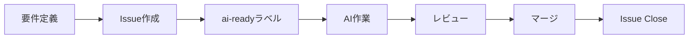

# 🚀 プロジェクト管理ガイド

## 概要
このプロジェクトでは、GitHub Issuesを使って機能別にタスクを管理し、AIツール（Claude等）に効率的に作業を依頼します。

## 🏷️ ラベルの使い方

| ラベル | 用途 | 優先度 |
|--------|------|--------|
| `enhancement` | 新機能追加 | 中 |
| `bug` | バグ修正 | 高 |
| `design` | デザイン改善 | 中 |
| `performance` | パフォーマンス改善 | 低 |
| `ai-ready` | AI作業可能 | - |
| `in-progress` | 作業中 | - |
| `review` | レビュー待ち | - |

## 📝 チケットの書き方

### 良いチケットの例
```markdown
タイトル: [機能] ヘッダーにアニメーション効果を追加

## 概要
スクロール時にヘッダーが縮小するアニメーションを実装

## 要件
- スクロール100px以降でヘッダーサイズを80%に
- 滑らかなtransition効果（0.3秒）
- モバイルでも動作すること

## AI向けコンテキスト
該当ファイル: /index.html の <header>部分
使用技術: CSS transition, JavaScript scroll event
```

### 悪いチケットの例
```
ヘッダーを直して
```

## 🤖 AIに作業依頼する流れ

1. **チケット作成**
   - GitHub Issuesでチケットを作成
   - テンプレートを使用
   - `ai-ready`ラベルを付ける

2. **AIに依頼**
   ```
   「GitHub Issue #5 の作業をお願いします」
   「https://github.com/marl0707/ronshoal-website/issues/5」
   ```

3. **作業確認**
   - AIが作業完了後、結果を確認
   - 必要に応じて修正依頼

4. **チケットクローズ**
   - 完了したらIssueをClose
   - 成果物をコミット

## 💡 便利なテクニック

### 複数タスクの一括依頼
```
以下のIssueを順番に対応してください：
- #5: ヘッダーアニメーション
- #6: フッター改善
- #7: お問い合わせフォーム追加
```

### コンテキスト共有
```
プロジェクトの基本情報：
- デザインシステム: /style-guide.md
- カラーパレット: CSS変数で定義済み
- レスポンシブ: 768px, 1024px, 1440pxで分岐
```

## 📊 プロジェクト状況の把握

### Issueの一覧表示
```bash
# オープン中のIssue
https://github.com/marl0707/ronshoal-website/issues

# AIで作業可能なもの
https://github.com/marl0707/ronshoal-website/issues?q=is%3Aopen+label%3Aai-ready
```

### マイルストーン
大きな機能追加は、マイルストーンでグループ化：
- v1.0: 基本機能
- v1.1: パフォーマンス改善
- v2.0: 新機能追加

## 🔄 ワークフロー例



## 📚 参考リンク
- [GitHub Issues ドキュメント](https://docs.github.com/ja/issues)
- [効果的なIssueの書き方](https://docs.github.com/ja/issues/tracking-your-work-with-issues/creating-an-issue)